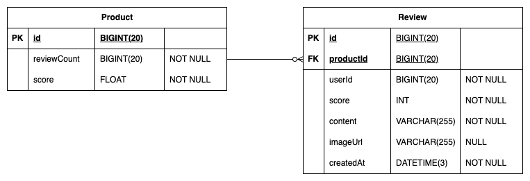

# 항해99-취업리부트코스-기업과제 01

## 과제 주요 구현 기능
- 상품에 대한 review 작성
- 상품별 review 점수, 개수, 리뷰 내용 조회

> **고려하지 않아도 되는 사항**
> - 회원가입, 로그인은 고려하지 않습니다.
>   - 요청 DTO 로 유저 아이디를 받고, 요청 DTO 로 들어온 유저는 항상 유효하다고 생각합니다.
> - 상품 테이블은 주어진 명세대로 사용합니다. (추가 필드는 고려하지 않습니다.)
> ```sql
> CREATE TABLE IF NOT EXISTS `Product` (
>     `id`          BIGINT(20) NOT NULL AUTO_INCREMENT PRIMARY KEY,
>     `reviewCount` BIGINT(20) NOT NULL,
>     `score`       FLOAT  NOT NULL
> ) ENGINE = InnoDB CHARSET = utf8;
> ```

<details>
<summary>기능 명세서</summary>

### 리뷰 조회

**기능 설명**
- 상품 Id 에 해당하는 특정 상품의 리뷰 목록을 조회합니다.


- 리뷰 조회 API
    - GET /products/{productId}/reviews?cursor={cursor}&size={size}


- 요청 파라미터

  | param | description |
  | --- | --- |
  | productId | 상품 아이디 |
  | cursor | 커서 값 (직전 조회 API 의 응답으로 받은 cursor 값 |
  | size | 조회 사이즈 (default = 10) |

- 응답 예시

    ```json
    {
        "totalCount": 15, // 해당 상품에 작성된 총리뷰 수
        "score": 4.6, // 평균 점수
        "cursor": 6,
        "reviews": [
            {
                "id": 15,
                "userId": 1, // 작성자 유저 아이디
                "score": 5,
                "content": "이걸 사용하고 제 인생이 달라졌습니다.",
                "imageUrl": "/image.png",
                "createdAt": "2024-11-25T00:00:00.000Z"
            },
            {
                "id": 14,
                "userId": 3, // 작성자 유저 아이디
                "score": 5,
                "content": "이걸 사용하고 제 인생이 달라졌습니다.",
                "imageUrl": null,
                "createdAt": "2024-11-24T00:00:00.000Z"
            }
        ]
    }
    ```
**주의할 점**
- 리뷰는 ‘가장 최근에 작성된 리뷰’ 순서대로 조회합니다.

**기술적 요구 사항**
- Mysql 조회 시 인덱스를 잘 탈 수 있게 설계해야 합니다.
- (Optional) 테스트 코드를 작성하면 좋습니다.

### 리뷰 등록

**기능 설명**
- 상품 Id 에 해당하는 특정 상품의 리뷰를 작성합니다.


- 리뷰 조회 API
    - POST /products/{productId}/reviews


- 요청 파라미터
    - [이미지 파일]
      
      MultipartFile 타입의 단건 이미지
    - [요청부]

        ```json
        {
            "userId": 1,
            "score": 4,
            "content": "이걸 사용하고 제 인생이 달라졌습니다."
        }
        ```

- 응답 예시

  None

**비즈니스 요구 사항**
- 리뷰는 존재하는 상품에만 작성할 수 있습니다.
- 유저는 하나의 상품에 대해 하나의 리뷰만 작성 가능합니다.
- 유저는 1 ~ 5점 사이의 점수로 리뷰를 남길 수 있습니다.
- 사진은 선택적으로 업로드 가능합니다.
    - 사진은 S3 에 저장된다고 가정하고, S3 적재 부분은 dummy 구현체를 생성합니다.
      (실제 S3 연동을 할 필요는 없습니다.)

**기술적 요구 사항**
- 상품 테이블에 reviewCount 와 score 가 잘 반영되어야 한다.
- (Optional) 동시성을 고려한 설계를 해주세요. 많은 유저들이 동시에 리뷰를 작성할 때, 발생할 수 있는 문제를 고려해보세요.
</details>

<details>
<summary>API 문서</summary>

# 리뷰 조회

## 명세

## 설명

path parameter {productId} 에 해당하는 상품의 리뷰 목록을 조회합니다.

- 조회 크기 (size, default = 10) → 조회 시, size 크기만큼 조회합니다.
- 정렬 기준
    - 리뷰 생성일 내림 차순

## 요청

GET `http://localhost:8080/products/{productId}/reviews?cursor={cursor}&size={size}`


- Path Parameter

    | 이름 | 타입 | 설명 | 필수 |
    | --- | --- | --- | --- |
    | productId | Integer | 상품 DB Id | O |
- Query Parameter

    | 이름 | 타입 | 설명 | 필수 |
    | --- | --- | --- | --- |
    | cursor | Integer | 커서 값 (직전 조회 API 의 응답으로 받은 cursor 값) | X |
    | size | Integer | 조회시 반환해야 할 리뷰 수, 기본값 10 | X |

## 응답

성공

- HTTP 상태코드 : 200 OK
    - Response Body

        | 이름 | 타입 | 설명 | 필수 |
        | --- | --- | --- | --- |
        | totalCount | Integer | 해당 상품에 작성된 총 리뷰 수 | O |
        | score | Double | 평균 리뷰 점수 | O |
        | cursor | Integer | 직전 조회 API 의 응답으로 받은 curosr 값 | X |
        | reviews | Review[] | 리뷰 목록 | O |
    - Review
        
        | 이름 | 타입 | 설명                                                 | 필수 |
        | --- | --- |----------------------------------------------------| --- |
        | id | Long | 리뷰 DB Id                                           | O |
        | userId | Long | 리뷰를 작성한 사용자 DB Id                                  | O |
        | score | Integer | 리뷰 점수<br>[1, 2, 3, 4, 5]                           | O |
        | content | String | 리뷰 내용                                              | O |
        | imageUrl | String | 리뷰 이미지 링크                                          | X |
        | createdAt | Date | 리뷰 생성 일시<br>[YYYY]-[MM]-[DD]T[HH]:[mm]:[ss].[SSS]Z | O |

# 리뷰 등록

## 명세

## 설명
path parameter {productId} 에 해당하는 상품의 리뷰를 등록합니다.

## 요청

POST `http://localhost:8080/products/{productId}/reviews`

- Request Part

    | 이름 | 타입 | 설명 | 필수 |
    | --- | --- | --- | --- |
    | file | MultipartFile | 이미지 파일 | X |
    | review | Review | 리뷰 내용 | O |
- Review

    | 이름 | 타입 | 설명 | 필수 |
    | --- | --- | --- | --- |
    | userId | Long | 리뷰를 작성하는 사용자 DB Id | O |
    | score | Integer | 리뷰 점수 <br>[1, 2, 3, 4, 5] | O |
    | content | String | 리뷰 내용 | O |

## 응답

성공

- HTTP 상태코드 : 200 OK
</details>

## ERD 설계 및 Database Table DDL


### Product
```sql
CREATE TABLE `Product` (
         `id`          BIGINT(20) NOT NULL AUTO_INCREMENT PRIMARY KEY,
         `reviewCount` BIGINT(20) NOT NULL,
         `score`       FLOAT  NOT NULL
) ENGINE = InnoDB CHARSET = utf8;
```

### Review
```sql
CREATE TABLE `Review` (
          `id`          BIGINT(20) NOT NULL AUTO_INCREMENT PRIMARY KEY,
          `productId`   BIGINT(20) NOT NULL,
          `userId`      BIGINT(20) NOT NULL,
          `score`       INT  NOT NULL,
          `content`     VARCHAR(255) NOT NULL,
          `imageUrl`    VARCHAR(255) NULL,
          `createdAt`   DATETIME(3) NOT NULL,
          FOREIGN KEY (`productId`) REFERENCES Product(`id`)
) ENGINE = InnoDB CHARSET = utf8;
```
