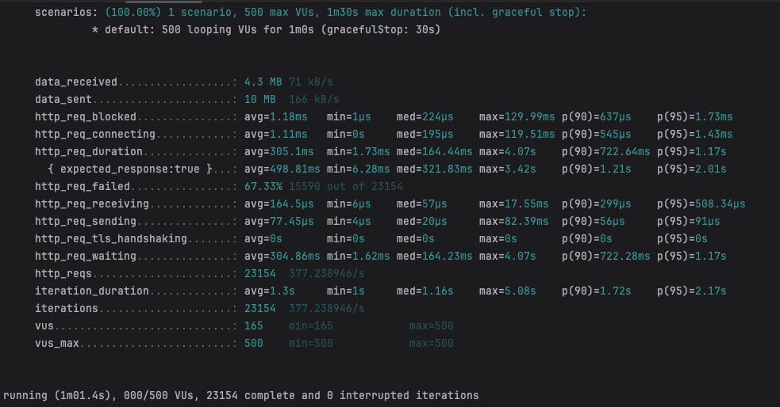

# 항해99-취업리부트코스-기업과제 01

<details>
<summary>프로젝트 구조 및 실행 방법</summary>

### 프로젝트 구조
- docker-compose 를 기반으로 필요한 인프라를 설정하였음

### 프로젝트 실행 방법
- github repository clone
- `./gradlew build` - Spring Project Build 및 jar 파일 생성
- `docker compose build` - Docker Compose Build 및 Image 생성
- `docker compose up -d` - Docker Compose 실행
- `docker compose down` - Docker Compose 종료
</details>

## 과제 주요 구현 기능
- 상품에 대한 review 작성
- 상품별 review 점수, 개수, 리뷰 내용 조회

> **고려하지 않아도 되는 사항**
> - 회원가입, 로그인은 고려하지 않습니다.
>   - 요청 DTO 로 유저 아이디를 받고, 요청 DTO 로 들어온 유저는 항상 유효하다고 생각합니다.
> - 상품 테이블은 주어진 명세대로 사용합니다. (추가 필드는 고려하지 않습니다.)
> ```sql
> CREATE TABLE IF NOT EXISTS `Product` (
>     `id`          BIGINT(20) NOT NULL AUTO_INCREMENT PRIMARY KEY,
>     `reviewCount` BIGINT(20) NOT NULL,
>     `score`       FLOAT  NOT NULL
> ) ENGINE = InnoDB CHARSET = utf8;
> ```

<details>
<summary>기능 명세서</summary>

### 리뷰 조회

**기능 설명**
- 상품 Id 에 해당하는 특정 상품의 리뷰 목록을 조회합니다.


- 리뷰 조회 API
    - GET /products/{productId}/reviews?cursor={cursor}&size={size}


- 요청 파라미터

  | param | description |
  | --- | --- |
  | productId | 상품 아이디 |
  | cursor | 커서 값 (직전 조회 API 의 응답으로 받은 cursor 값 |
  | size | 조회 사이즈 (default = 10) |

- 응답 예시

    ```json
    {
        "totalCount": 15, // 해당 상품에 작성된 총리뷰 수
        "score": 4.6, // 평균 점수
        "cursor": 6,
        "reviews": [
            {
                "id": 15,
                "userId": 1, // 작성자 유저 아이디
                "score": 5,
                "content": "이걸 사용하고 제 인생이 달라졌습니다.",
                "imageUrl": "/image.png",
                "createdAt": "2024-11-25T00:00:00.000Z"
            },
            {
                "id": 14,
                "userId": 3, // 작성자 유저 아이디
                "score": 5,
                "content": "이걸 사용하고 제 인생이 달라졌습니다.",
                "imageUrl": null,
                "createdAt": "2024-11-24T00:00:00.000Z"
            }
        ]
    }
    ```
**주의할 점**
- 리뷰는 ‘가장 최근에 작성된 리뷰’ 순서대로 조회합니다.

**기술적 요구 사항**
- Mysql 조회 시 인덱스를 잘 탈 수 있게 설계해야 합니다.
- (Optional) 테스트 코드를 작성하면 좋습니다.

### 리뷰 등록

**기능 설명**
- 상품 Id 에 해당하는 특정 상품의 리뷰를 작성합니다.


- 리뷰 조회 API
    - POST /products/{productId}/reviews


- 요청 파라미터
    - [이미지 파일]
      
      MultipartFile 타입의 단건 이미지
    - [요청부]

        ```json
        {
            "userId": 1,
            "score": 4,
            "content": "이걸 사용하고 제 인생이 달라졌습니다."
        }
        ```

- 응답 예시

  None

**비즈니스 요구 사항**
- 리뷰는 존재하는 상품에만 작성할 수 있습니다.
- 유저는 하나의 상품에 대해 하나의 리뷰만 작성 가능합니다.
- 유저는 1 ~ 5점 사이의 점수로 리뷰를 남길 수 있습니다.
- 사진은 선택적으로 업로드 가능합니다.
    - 사진은 S3 에 저장된다고 가정하고, S3 적재 부분은 dummy 구현체를 생성합니다.
      (실제 S3 연동을 할 필요는 없습니다.)

**기술적 요구 사항**
- 상품 테이블에 reviewCount 와 score 가 잘 반영되어야 한다.
- (Optional) 동시성을 고려한 설계를 해주세요. 많은 유저들이 동시에 리뷰를 작성할 때, 발생할 수 있는 문제를 고려해보세요.
</details>

<details>
<summary>API 문서</summary>

# 리뷰 조회

## 명세

## 설명

path parameter {productId} 에 해당하는 상품의 리뷰 목록을 조회합니다.

- 조회 크기 (size, default = 10) → 조회 시, size 크기만큼 조회합니다.
- 정렬 기준
    - 리뷰 생성일 내림 차순

## 요청

GET `http://localhost:8080/products/{productId}/reviews?cursor={cursor}&size={size}`


- Path Parameter

    | 이름 | 타입 | 설명 | 필수 |
    | --- | --- | --- | --- |
    | productId | Integer | 상품 DB Id | O |
- Query Parameter

    | 이름 | 타입 | 설명 | 필수 |
    | --- | --- | --- | --- |
    | cursor | Integer | 커서 값 (직전 조회 API 의 응답으로 받은 cursor 값) | X |
    | size | Integer | 조회시 반환해야 할 리뷰 수, 기본값 10 | X |

## 응답

성공

- HTTP 상태코드 : 200 OK
    - Response Body

        | 이름 | 타입 | 설명 | 필수 |
        | --- | --- | --- | --- |
        | totalCount | Integer | 해당 상품에 작성된 총 리뷰 수 | O |
        | score | Double | 평균 리뷰 점수 | O |
        | cursor | Integer | 직전 조회 API 의 응답으로 받은 curosr 값 | X |
        | reviews | Review[] | 리뷰 목록 | O |
    - Review
        
        | 이름 | 타입 | 설명                                                 | 필수 |
        | --- | --- |----------------------------------------------------| --- |
        | id | Long | 리뷰 DB Id                                           | O |
        | userId | Long | 리뷰를 작성한 사용자 DB Id                                  | O |
        | score | Integer | 리뷰 점수<br>[1, 2, 3, 4, 5]                           | O |
        | content | String | 리뷰 내용                                              | O |
        | imageUrl | String | 리뷰 이미지 링크                                          | X |
        | createdAt | Date | 리뷰 생성 일시<br>[YYYY]-[MM]-[DD]T[HH]:[mm]:[ss].[SSS]Z | O |

# 리뷰 등록

## 명세

## 설명
path parameter {productId} 에 해당하는 상품의 리뷰를 등록합니다.

## 요청

POST `http://localhost:8080/products/{productId}/reviews`

- Request Part

    | 이름 | 타입 | 설명 | 필수 |
    | --- | --- | --- | --- |
    | file | MultipartFile | 이미지 파일 | X |
    | review | Review | 리뷰 내용 | O |
- Review

    | 이름 | 타입 | 설명 | 필수 |
    | --- | --- | --- | --- |
    | userId | Long | 리뷰를 작성하는 사용자 DB Id | O |
    | score | Integer | 리뷰 점수 <br>[1, 2, 3, 4, 5] | O |
    | content | String | 리뷰 내용 | O |

## 응답

성공

- HTTP 상태코드 : 200 OK
</details>

## ERD 설계 및 Database Table DDL


### Product
```sql
CREATE TABLE `Product` (
         `id`          BIGINT(20) NOT NULL AUTO_INCREMENT PRIMARY KEY,
         `reviewCount` BIGINT(20) NOT NULL,
         `score`       FLOAT  NOT NULL
) ENGINE = InnoDB CHARSET = utf8;
```

### Review
```sql
CREATE TABLE `Review` (
          `id`          BIGINT(20) NOT NULL AUTO_INCREMENT PRIMARY KEY,
          `productId`   BIGINT(20) NOT NULL,
          `userId`      BIGINT(20) NOT NULL,
          `score`       INT  NOT NULL,
          `content`     VARCHAR(255) NOT NULL,
          `imageUrl`    VARCHAR(255) NULL,
          `createdAt`   DATETIME(3) NOT NULL,
          FOREIGN KEY (`productId`) REFERENCES Product(`id`)
) ENGINE = InnoDB CHARSET = utf8;

# Index 추가
CREATE INDEX idx_product_user ON Review (productId, userId);
```

# 주요 구현 사항
## 상품 리뷰 목록 조회

###  JPQL 을 이용한 요구사항을 만족하는 쿼리 작성
- 리뷰 생성일을 기준으로 내림 차순 정렬
- cursor 기반 조회
- size 크기만큼 조회


```sql
SELECT *
FROM Review r
WHERE ({cursor} IS NULL OR r.id < {cursor}) AND r.productId = {productId}
ORDER BY r.createdAt DESC
```

## 상품 리뷰 등록
### 존재하지 않는 상품에 대해서 리뷰 작성 불가
- 서비스 코드 로직 분리 수행
  - 상품 DB Id 에 해당하는 상품의 존재 유무를 확인하는 책임은 ProductService 가 가짐
- 존재하지 않는 상품에 대해서 리뷰 작성 시도 시, 커스텀 예외를 throw 하도록 함

``` java
// 리뷰 작성 서비스 코드
@RequiredArgsConstructor
@Service
public class ReviewService {

    private final ProductService productService;
    
    // AOP 를 활용한 분산 락 구현 시, AOP 기능에서도 @Transactional이 작동하도록 하였음
    @DistributedLock(key = "#productId + '-' + #request.userId()") 
    public void createProductReview(Long productId, MultipartFile file, CreateProductReviewRequest request) {
        productService.getProductById(productId);
    
        // 이후 리뷰 작성 로직
        ...
    }
}

// 상품 DB Id 로 상품의 존재 확인 유무 서비스 코드
@RequiredArgsConstructor
@Service
public class ProductService {

    private final ProductRepository productRepository;

    public Product getProductById(Long productId) {
        return productRepository.findTopById(productId).orElseThrow(() -> new CustomCommonException(ProductErrorCode.NOT_FOUND_PRODUCT));
    }

}
```

### 사용자는 하나의 상품에 대해 하나의 리뷰만 작성 가능
- 사용자가 하나의 상품에 대해 이미 작성한 리뷰가 있는 상태에서, 해당 상품에 리뷰를 작성하려고 시도하면 커스텀 예외를 throw 하도록 함
```java
// 리뷰 작성 서비스 코드
@RequiredArgsConstructor
@Service
public class ReviewService {

    private final ReviewRepository reviewRepository;
    
    private final ProductService productService;

    // AOP 를 활용한 분산 락 구현 시, AOP 기능에서도 @Transactional이 작동하도록 하였음
    @DistributedLock(key = "#productId + '-' + #request.userId()")
    public void createProductReview(Long productId, MultipartFile file, CreateProductReviewRequest request) {
        productService.getProductById(productId);
    
        if (reviewRepository.findTopByProductIdAndUserId(productId, request.userId()).isPresent()) {
            throw new CustomCommonException(ProductErrorCode.ALREADY_REVIEWED_PRODUCT);
        }
        
        // 이후 리뷰 작성 로직
        ...
    }
}
```

### 사용자는 1~5점 사이의 리뷰 점수만 등록 가능
- RequestDTO 에서 Validation 수행
```java
public record CreateProductReviewRequest(
        @NotNull(message = "사용자 Id 는 필수 입력값 입니다.")
        Long userId,
        
        @Min(value = 1, message = "리뷰 점수는 1 ~ 5 사이의 정수 이어야 합니다.")
        @Max(value = 5, message = "리뷰 점수는 1 ~ 5 사이의 정수 이어야 합니다.")
        @NotNull(message = "리뷰 점수는 필수 입력값 입니다.")
        Integer score,
        
        String content
) {...}
```

### Dummy File Service 구현
- 추후 확장 가능성을 고려하여, interface 선언
``` java
public interface FileService {
    String uploadFile(MultipartFile file);
}
```

- Local 환경에 파일을 저장하는 Dummy File Service 구현
- 실제 localhost:8080 을 통해 파일에 접근 가능하도록 spring 의 resource.static-path 사용
  - spring 의 기본 static path 가 아닌, 사용자가 application.yml 을 통해서 설정 가능하도록 하였음
```java
@Service
public class DummyFileService implements FileService{

    @Value("${spring.web.resources.static-path}")
    private String fileDir;

    @Override
    public String uploadFile(MultipartFile file) {
        if (file == null || file.isEmpty()) {
            return null;
        }
        try {
            String fileName = UUID.randomUUID() + "." + FileUtil.getExtension(file);
            String fullPath = fileDir + fileName;
            file.transferTo(new File(fullPath));
            return "/" + fileName;
        } catch (IOException e) {
            throw new CustomCommonException(CommonErrorCode.UNABLE_TO_UPLOAD_FILE);
        }
    }
}
```

### 상품 리뷰 정보 수정 기능
- 상품 리뷰 작성 이후, 상품의 리뷰 정보를 수정하는 기능
- 상품 테이블에 리뷰 정보(개수와 평균 점수)가 잘 반영되도록, DB 조회를 통해서 정보를 수정하도록 함
``` java
@RequiredArgsConstructor
@Service
public class ReviewService {

    private final ReviewRepository reviewRepository;
    
    private final ProductService productService;
    
    ...
    
    // AOP 를 활용한 분산 락 구현 시, AOP 기능에서도 @Transactional이 작동하도록 하였음
    @DistributedLock(key = "#productId")
    public void updateProductReviewInfo(Long productId) {
        Product product = productService.getProductById(productId);
    
        // 현재 상태의 상품의 리뷰 정보 조회
        GetProductReviewInfoDTO productReviewInfo = reviewRepository.findReviewInfoByProductId(productId);
        
        // 조회한 리뷰 정보로 상품 리뷰 정보 수정
        product.updateReviewInfo(productReviewInfo.totalCount(), productReviewInfo.score());
    }
}
```

# 추가 기술적 구현 사항
## 리뷰 테이블의 (userId, productId) 에 대한 복합 인덱스 설정
- productId 에 해당하는 상품에 대해서 userId 에 해당하는 사용자가 작성한 리뷰를 조회하는 쿼리의 성능 향상을 위한 것


``` sql
CREATE INDEX idx_product_user ON Review (productId, userId);
```

``` java
public interface ReviewRepository extends CrudRepository<Review, Long> {

    Optional<Review> findTopByProductIdAndUserId(Long productId, Long userId);

}
```

- 해당 메서드 실행시, 실행되는 쿼리와 MySQL 의 EXPLAN 명령어를 통해 인덱스를 정확하게 구현하였는지 확인
  

- k6 성능 테스트 도구를 이용하여 인덱스 추가 전후의 성능 차이 비교
  
    (최대 500명의 사용자가 1분동안 지속적으로 요청을 보내는 상황)
  

- 인덱스 추가 이전 성능 테스트 결과
  
  - 총 23,154 개의 요청 처리. 평균 처리 시간 : 1.3초

    
- 인덱스 추가 이후 성능 테스트 결과
  
  - 총 26,508 개의 요청 처리. 평균 처리 시간 : 1.13초


- 인덱스 추가 이후, 약 15% 의 성능 향상을 보였음

## 동시성을 고려한 설계
- 동시에 많은 사용자가 접근하여 상품의 리뷰를 등록하는 경우, 상품의 리뷰가 적절한 값으로 등록되지 않거나 요청이 누락될 수 있음


- 동시성을 고려하지 않은 상황에서 많은 사용자들이 동시에 리뷰를 작성하는 상황을 테스트함
  - k6 성능 테스트 도구를 활용 및 최대 500명의 사용자가 1분동안 지속적으로 요청을 보내는 상황
  - 테스트 후, DB 를 확인
    - 비즈니스 요구사항인 `사용자는 하나의 상품에 대해 하나의 리뷰만 작성 가능합니다.`를 위반한 데이터
      

- 상품의 리뷰 작성과 상품의 리뷰 정보 수정 기능을 분리함.
  - 상품의 리뷰 작성 기능 : 동일한 (productId, userId) 쌍에 대한 동시 요청 처리 필요
  - 상품의 리뷰 정보 수정 기능 : 동일한 productId 에 대한 동시 요청 처리 필요
```java
@RequiredArgsConstructor
@RequestMapping("/products/{productId}/reviews")
@RestController
public class ReviewAPI {

    private final ReviewService reviewService;
    
    ...

    @PostMapping
    public ResponseEntity<?> createProductReview(...) {
        // 상품의 리뷰 작성 기능
        reviewService.createProductReview(productId, file, request);
        
        // 상품의 리뷰 정보 수정 기능
        reviewService.updateProductReviewInfo(productId);
        
        return ResponseEntity.ok().build();
    }
}
```

### 상품의 리뷰 작성 기능
- 해당 기능의 동시성 처리를 위해 2가지 해결 방안을 고려하였음
  - 네임드 Lock 방식의 분산 Lock 방법 구현
    - 레디스를 이용한 구현 방법 고려
  - Review(리뷰) 테이블 정의 시, productId 와 userId 를 복합으로 고려하는 유니크 제약 조건 설정
      - 유니크 제약 조건을 위배할 시, 예외 처리 로직 구현이 필요함
  
  
- 추가적으로 synchronized 키워드 및 비관적 Lock, 낙관적 Lock 을 고려하였지만, 이는 아래의 이유로 선택 사항에서 제외함
  - synchronized 키워드
    - 메서드에 Lock 을 설정하는 방식으로 DB의 데이터에 대한 정확한 동시성 제어가 제한됨
    - 임계 구역에 동시에 하나의 스레드에 대한 접근을 보장하기 때문에, 멀티 프로세스 환경에서는 동시성 제어가 정확하게 처리되지 않을 수 있음
  - Product(제품) 조회 시, DB 에 읽기 및 쓰기 비관적 Lock 적용
    - 동시성에 의해 문제가 생기는 부분은 리뷰이지만, 제품에 Lock 을 설정하는 것이 맞지 않다고 생각함
    - 동시성 제어가 정확하게 이루어지지만, DB row 에 Lock 을 설정하는 것 이기 때문에 성능 저하가 예상됨
  - 낙관적 Lock
    - 낙관적 Lock 은 데이터의 Version 을 이용한 동시성 제어를 수행함. 즉 데이터 수정에 대해서는 적합하지만, 데이터 생성시의 동시성 제어에는 적합하지 않다고 판단함


- 고려한 2가지 해결 방안에 대해서 구현 후, k6 성능 테스트 도구를 활용한 테스트와 비즈니스 로직을 고려하여 구현 방법을 채택함
  
    (최대 500명의 사용자가 동일한 userId를 사용하여 1분동안 지속적으로 요청을 보내는 상황)


- (채택 방법) 네임드 Lock 방식의 분산 Lock 방법 구현
  - Java 의 Redis 클라이언트인 Pub/Sub 방식의 Redisson 을 이용하여 AOP 방법으로 분산 Lock 을 구현하였음
    - 리뷰 작성 로직에 들어가기 위해서는 productId 와 userId 로 이루어진 key 를 획득해야 함 
    ```java
    @DistributedLock(key = "#productId + '-' + #request.userId()")
    public void createProductReview(Long productId, MultipartFile file, CreateProductReviewRequest request) {
        ... // 리뷰 작성 로직
    }
    ```

- Review(리뷰) 테이블 정의 시, productId 와 userId 를 복합으로 고려하는 유니크 제약 조건 설정
  - Review(리뷰) 엔티티에 unique 제약조건 추가
    
    
  
  - 상품의 리뷰 작성 서비스 코드 수정 (유니크 제약 조건 위배 시, 예외 처리 로직 구현)
    
    

- 두 방법 모두 k6 테스트 결과, 
  
  비즈니스 요구사항인 `사용자는 하나의 상품에 대해 하나의 리뷰만 작성 가능합니다.`를 지키고 있음을 확인함


- 하지만, 유니크 제약 조건 방법의 경우 중복 데이터가 존재 하여도 파일을 업로드 해야하는 로직으로 이루어 져 있기 때문에 네임드 Lock 방식을 채택하였음

### 상품의 리뷰 정보 수정 기능

- 네임드 Lock 방식의 분산 Lock 방법 구현
    - 상품의 리뷰 작성 기능을 통해, AOP 기능을 활용한 분산 Lock 을 구현하였기 때문에 쉬운 구현이 가능하였음
        - 리뷰 리뷰 정보 수정 로직에 들어가기 위해서는 productId 로 이루어진 key 를 획득해야 함
      ```java
      @DistributedLock(key = "#productId")
      public void updateProductReviewInfo(Long productId) {
          ... // 리뷰 정보 수정 로직
      }
      ```

## 테스트 코드 작성
- 기능의 정확한 동작을 검증하기 위한 테스트 코드 작성 
- 통합 및 (컨트롤렁, 서비스, 레포지토리, 도메인) 단위 테스트 코드를 총 42개 작성하였음
- 분산 Lock 의 예외 처리 기능을 제외한 모든 코드에 대해서 라인 커버리지 100% 달성
